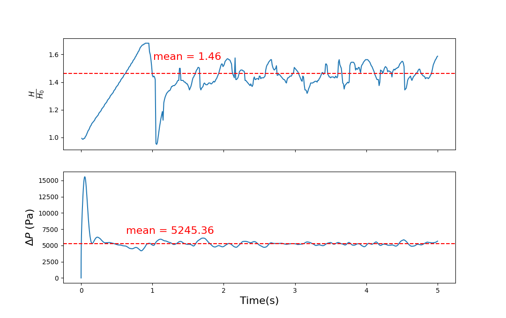

Title: Multiphase Euler-Euler simulation of a fluidized bed
Date: 2026-09-20 17:00
Category: CFD Cases
Tags: OpenFOAM, multiphase flow, fluidized bed, Euler-Euler
Slug: fluidized-bed
Summary: Simulation of a fluidized bed in 2D using OpenFOAM.
Image: images/fluidized_bed/fb.gif

<!--  -->

---

**Description:** Transient turbulent Euler–Euler simulation of a fluidized bed

**Reference Paper:** [Experimental and computational study of gas-solid fluidized bed hydrodynamics](https://www.sciencedirect.com/science/article/abs/pii/S0009250905004653)

---

# Model

The model consists of a rectangular domain of width *0.28 m*, height *1 m*, and depth *0.025 m*.

The initial solids height was *0.4 m*, with an initial solid fraction ($\alpha_s$) of *0.6* and a maximum solid fraction of *0.63*.

# Meshing

Meshing was performed using `blockMesh`.

The resulting mesh had 498,443 points and 448,000 hexahedral cells.

# Physics

The model was simulated using the two-phase Euler–Euler model, which assumes continuum mechanics for both the fluid phase—in this case, gas—and the solid phase.

RAS models were used to compute the turbulence in both phases.

The $k-\epsilon$ model was used for closure of the turbulence stress in the gas phase.

For the solid phase, **Kinetic Theory of Dense/Granular Flows (KTGF)** was used to close the momentum equations.

The table below provides information about the models used for closure of the equations.

| Closure | Model |
|---|---|
| Momentum drag exchange ($K_{gs}$) | `GidaspowErgunWenYu` |
| Heat transfer | `RanzMarshall` |
| Granular viscosity | `Gidaspow` |
| Granular conductivity | `Gidaspow` |
| Granular pressure | `Lun` |
| Frictional stress | `JohnsonJacksonSchaeffer` |
| Radial model | `SinclairJackson` |

# Simulation

The case was simulated using the **multiphaseEuler** solver in OpenFOAM.

Some important parameters and their values are given in the table below.

| Parameter | Value | Comment |
|---|---:|---|
| Particle density, $\rho_s$ | $2500\ \mathrm{kg/m^3}$ | Glass beads |
| Gas density, $\rho_g$ | $1.225\ \mathrm{kg/m^3}$ | Air |
| Mean particle diameter, $d_s$ | $275\ \mu\mathrm{m}$ | Uniform distribution |
| Restitution coefficient, $e_{ss}$ | $0.95$ | Range in literature: 0.9–0.99 |
| Specularity coefficient, $e_{sp}$ | $0.2$ | For the particle wall condition |
| Initial solids packing, $\epsilon_{s0}$ | $0.6$ | Fixed value |
| Maximum solids packing, $\epsilon_{s,\mathrm{max}}$ | $0.63$ | Fixed value |
| Superficial gas velocity, $U$ | $0.38\ \mathrm{m/s}$ | Approximately $0.5$–$6U_{mf}$ |

## Boundary Conditions

| Parameter | Internal Field | Inlet | Outlet | Walls |
|---|---|---|---|---|
| **U.particles** | `uniform (0 0 0)` | `interstitialInletVelocity uniform (0 0.38 0); alpha.air` | `pressureInletOutletVelocity; phi.air` | `noSlip` |
| **U.air** | `uniform (0 0 0)` | `fixedValue uniform (0 0 0)` | `fixedValue uniform (0 0 0)` | `JohnsonJacksonParticleSlip` |
| **Pressure ($p_{rgh}$)** | `uniform 1e5` | `fixedFluxPressure value = 1e5` | `prghPressure; value = 1e5` | `fixedFluxPressure; value = 1e5` |
| **alpha.air** | Set using `setFields` | `zeroGradient` | `zeroGradient` | `zeroGradient` |
| **alpha.particles** | Set using `setFields` | `zeroGradient` | `zeroGradient` | `zeroGradient` |
| **Theta.particles** | `uniform 0` | `fixedValue; value = 1e-4` | `zeroGradient` | `JohnsonJacksonParticleTheta` |
| **k.air** | `uniform 1` | `fixedValue; value = 1` | `inletOutlet` | `kqRWallFunction` |
| **epsilon.air** | `uniform 10` | `fixedValue; value = 10` | `inletOutlet` | `epsilonWallFunction` |

The **transient** simulation was run for 5 s with an adaptive time step of $\Delta T = 0.0001$ using the PIMPLE (PISO/SIMPLE) algorithm.

The PISO algorithm was used with three non-orthogonal correctors and two correctors, along with drag correction.

# Validation

The results were validated against the reference paper mentioned above.

The important validation parameters were the expansion ratio $\frac{H}{H_0}$ and the pressure drop $\Delta p$.

Since the system exhibited oscillatory behavior after approximately 2 s, the time range from *3 s to 5 s* was used to compute the mean values.

The mean expansion ratio and pressure drop were calculated over this time range. These values are provided below along with the reference values.

| Parameter | Simulation | Reference |
|---|---:|---:|
| $\frac{H}{H_0}$ | 1.46 | 1.49 |
| $\Delta p$ (Pa) | 5245 | 5428 |

From the table above, it can be inferred that the simulation was successfully validated and that fluidization was successfully observed.
